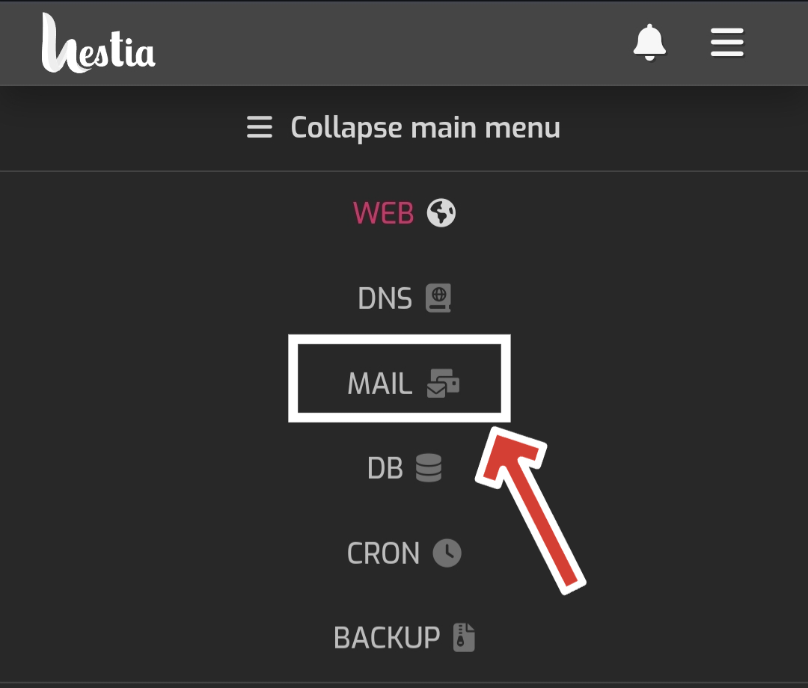

# Mail Verification 
## Detailed Guide know Mail Verification with Images

1. **Log in to [Noxicloud Panel](https://ncpanel.noxicloud.es:8083/)** using the provided credentials.
   
2. Click on **Expand Main Menu**.
   
   
3. Select **Mail** from the menu options.
   
   
4. Click on **Add Mail Account**.
   
   
5. Choose a **Name** for the account (e.g., `noreply`) and set a suitable **Password**.
   
   
6. Click **Save**.
   
7. Now, log in to FTP. If you're unsure how to do this, refer to [this guide](https://noxicloud-faq.gitbook.io/noxicloud/FTP/delete-quick-guide-on-accesing-ftp).
   
8. Navigate to `web/your_name.ncservers.xyz/public_html/config`.
   
9. Edit **Mail.php**:
   ```php
   <?php
   $mailEnabled = 1; // 0 - off, 1 - on

   $mailbox = 'mail.your_username.ncservers.xyz'; // Your SMTP mail host
   $mailport = '993'; // Your SMTP mail port
   $mailuser = 'noreply@your_username.ncservers.xyz'; // Your mail login
   $mailpass = 'your_password'; // Your mail password
   $mailtype = 'ssl'; // Mail security type (ssl or tls), set to false to disable security
   $yourmail = 'noreply@your_username.ncservers.xyz'; // Mail that you will use (same as $mailuser if applicable)
   ?>
   ```
   Replace all instances of `noreply@username.ncservers.xyz` with the email you created. If the username is `noreply`, replace `username` with the actual username provided by the bot.
   
10. Save the changes.

11. Return to the **config** folder.

12. Edit **Security.php** and set `$preactivateaccounts` to "false".

   Done! Now, email verification requests should be sent. Please ensure to check the spam folder as the mail bot is new and might be flagged as spam. If flagged, mark it as "not spam" to resolve the issue.
